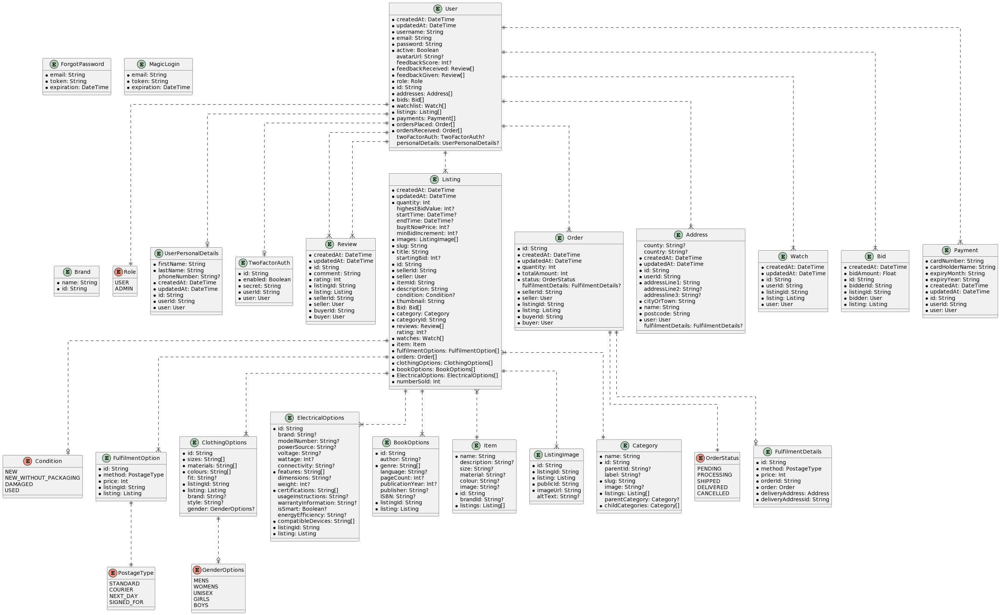

GitHub Copilot: # Prisma Schema Documentation

This is a documentation of the Prisma schema used in our application. The schema defines several models that represent the tables in our PostgreSQL database.

## Models

### Review

The `Review` model represents a review left by a user. It includes fields for the comment, rating, and the IDs of the listing, seller, and buyer. It has relations to the `Listing` and `User` models.

### Listing

The `Listing` model represents a listing in the marketplace. It includes fields for the quantity, highest bid value, start time, end time, buy it now price, minimum bid increment, images, slug, title, starting bid, seller ID, item ID, description, condition, thumbnail, category ID, reviews, rating, watches, item, fulfilment options, orders, clothing options, book options, electrical options, and number sold. It has relations to several other models, including `User`, `Category`, `Item`, `Review`, `Watch`, `Order`, `FulfilmentOption`, `ClothingOptions`, `BookOptions`, and `ElectricalOptions`.

### FulfilmentOption, ClothingOptions, ElectricalOptions, and BookOptions

These models represent various options for a listing. They include fields for the method and price (for `FulfilmentOption`), sizes, materials, colours, fit, brand, style, and gender (for `ClothingOptions`), brand, model number, power source, voltage, wattage, connectivity, features, dimensions, weight, certifications, usage instructions, warranty information, is smart, energy efficiency, and compatible devices (for `ElectricalOptions`), and author, genre, language, page count, publication year, publisher, and ISBN (for `BookOptions`).

### Order and FulfilmentDetails

The `Order` model represents an order placed by a user. It includes fields for the quantity, total amount, status, seller ID, listing ID, and buyer ID. It has a one-to-one relation with the `FulfilmentDetails` model, which includes fields for the method, price, order ID, and delivery address ID.

### Address

The `Address` model represents an address. It includes fields for the county, country, address lines, city or town, name, postcode, and user ID. It has a one-to-one relation with the `User` model and can be associated with `FulfilmentDetails`.

### Item

The `Item` model represents an item in a listing. It includes fields for the name, description, size, material, colour, image, and brand ID. It has a one-to-many relation with the `Listing` model.

### ListingImage

The `ListingImage` model represents an image associated with a listing. It includes fields for the listing ID, public ID, image URL, and alt text. It has a one-to-one relation with the `Listing` model.

### Category

The `Category` model represents a category that a listing can belong to. It includes fields for the name, parent ID, label, slug, and image. It has a one-to-many relation with the `Listing` model and a self-relation to represent parent and child categories.

### Brand

The `Brand` model represents a brand that an item can belong to. It includes a field for the name.

### Watch

The `Watch` model represents a watch that a user has on a listing. It includes fields for the user ID and listing ID. It has one-to-one relations with the `User` and `Listing` models.

### Bid

The `Bid` model represents a bid that a user has placed on a listing. It includes fields for the bid amount, bidder ID, and listing ID. It has one-to-one relations with the `User` and `Listing` models.

### Payment

The `Payment` model represents a payment made by a user. It includes fields for the card number, card holder name, expiry month, expiry year, and user ID. It has a one-to-one relation with the `User` model.

## Enums

The schema also defines several enums:

- `GenderOptions`: Represents the gender options for an item. It includes options for men's, women's, unisex, girls', and boys' items.
- `Role`: Represents the role of a user. It includes options for user and admin.
- `Condition`: Represents the condition of an item. It includes options for new, new without packaging, damaged, and used.
- `OrderStatus`: Represents the status of an order. It includes options for pending, processing, shipped, delivered, and cancelled.
- `PostageType`: Represents the type of postage for an order. It includes options for standard, courier, next day, and signed for.

## ERD

